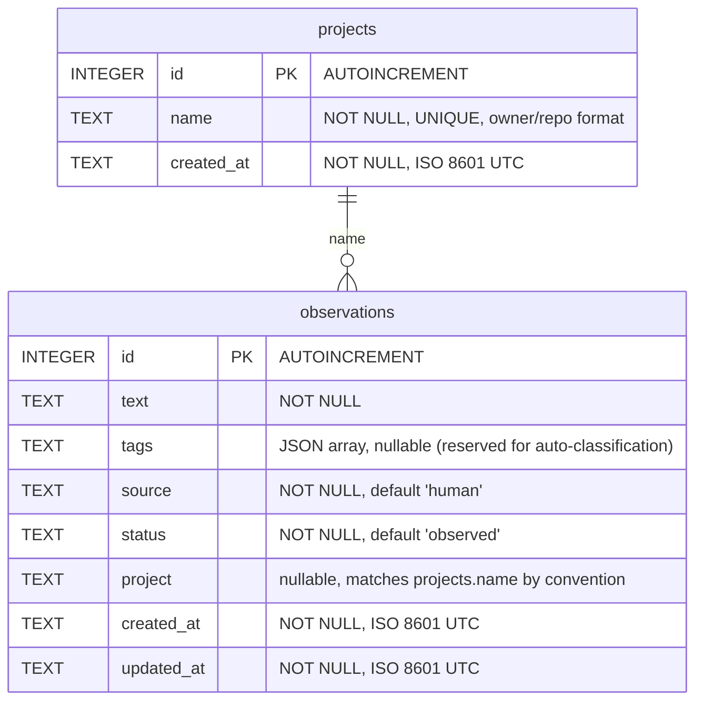

# Database Schema

SQLite database (`compound-eye.db`) with WAL mode enabled.

## Notes

- **Statuses** progress through: `observed` → `pattern_confirmed` → `solution_designed` → `automated`
- **Source** tracks who originated the observation (`human`, `claude`, or other agent identifiers)
- **Tags** column is reserved for future auto-classification; not currently populated
- **Projects** use `owner/repo` format (e.g. `anthropics/claude-code`). The `observations.project` column references `projects.name` by convention, not by foreign key — the projects table serves as a registry for the UI dropdown
- **Timestamps** use ISO 8601 UTC format, set automatically by SQLite `strftime()`
