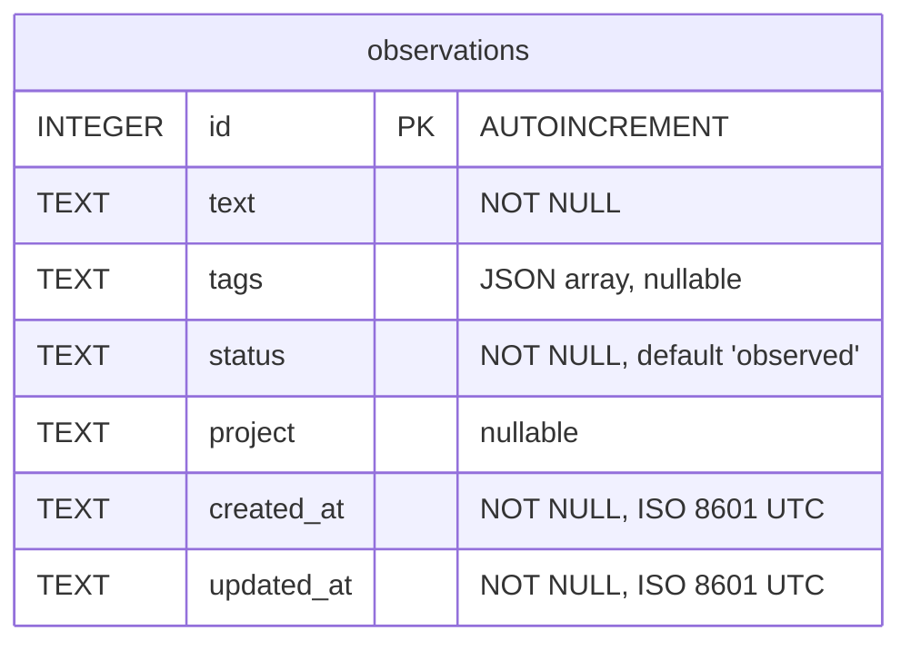

# Database Schema

SQLite database (`compound-eye.db`) with WAL mode enabled.

## Notes

- **Statuses** progress through: `observed` → `pattern_confirmed` → `solution_designed` → `automated`
- **Tags** are stored as a JSON array in a TEXT column, queried with `json_each()`
- **Timestamps** use ISO 8601 UTC format, set automatically by SQLite `strftime()`
