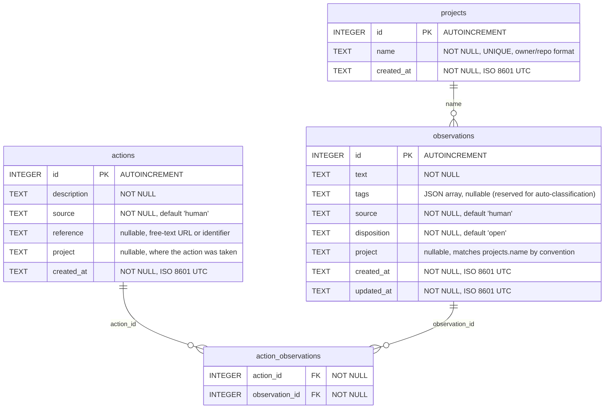

# Database Schema

SQLite database (`compound-eye.db`) with WAL mode enabled.

## Notes

- **Dispositions** represent human judgment on whether an observation needs attention: `open` (default), `addressed`, `wont_fix`, `deferred`
- **Actions** are an append-only log of what was done about observations. Each action can link to multiple observations via the `action_observations` junction table
- **Source** tracks who originated the observation or action (`human`, `claude`, or other agent identifiers)
- **Reference** on actions is a free-text field for linking to artifacts (PR URLs, commit SHAs, etc.) without coupling to any specific platform
- **Tags** column is reserved for future auto-classification; not currently populated
- **Projects** use `owner/repo` format (e.g. `anthropics/claude-code`). The `observations.project` column references `projects.name` by convention, not by foreign key — the projects table serves as a registry for the UI dropdown
- **Timestamps** use ISO 8601 UTC format, set automatically by SQLite `strftime()`
